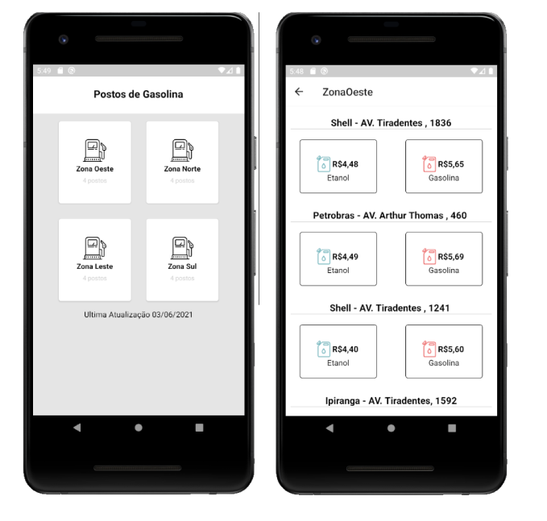

# AppPostosDeGasolina
>Aplicativo para ver preços de postos de gasolina!

## Funcionalidades
* Ver Preço dos Postos de gasolina de Londrina

## Telas


Instalando dependencias
```bash
$ npm install
```

Rodando projeto
```bash
$ npx react-native run-android
```

Foi ultilizado nesse projeto :

* VSCode
* Android Studio
* Firebase
* React Native