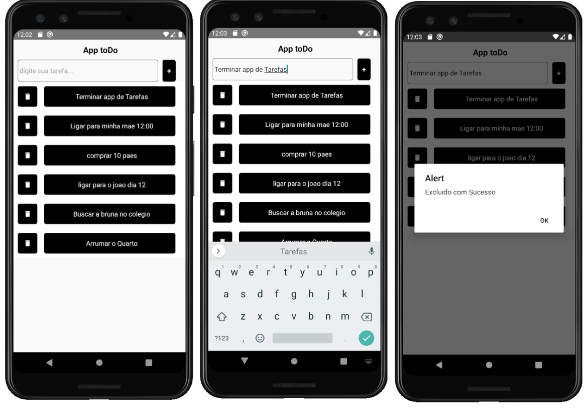

# toDo

>Aplicativo de lista de tarefas 

## Funcionalidades

* Lista de tarefas do dia a dia

## Telas




Instalando dependencias
```bash
$ npm install
```

Rodando projeto
```bash
$ npx react-native run-android
```

Foi ultilizado nesse projeto :

* VSCode
* Android Studio
* Firebase
* React Native

